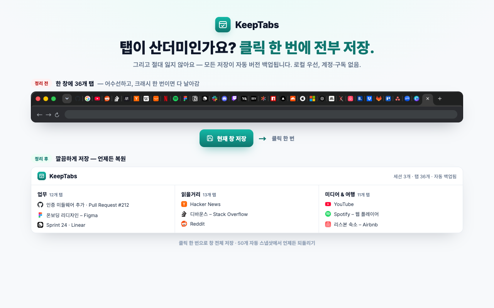
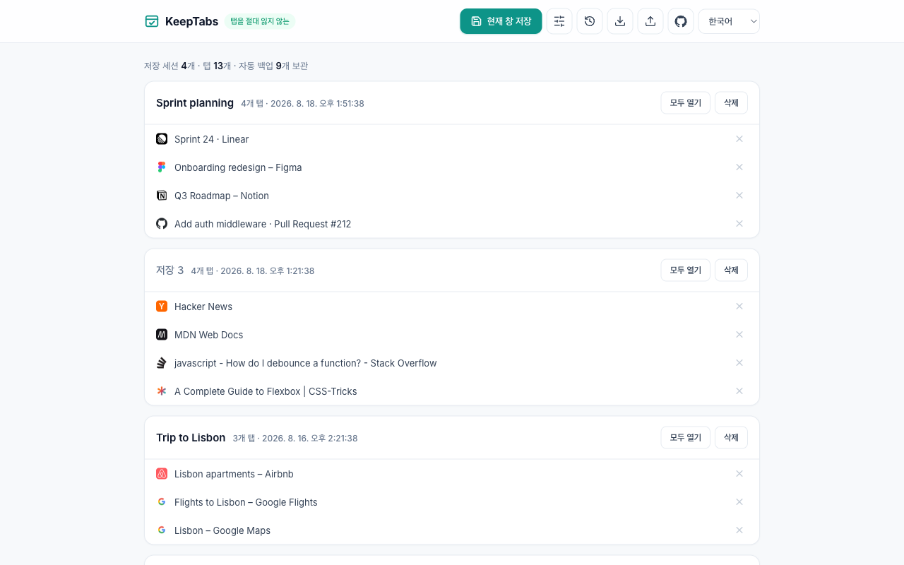
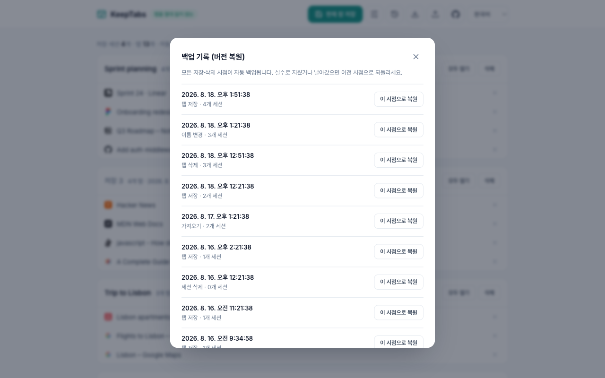
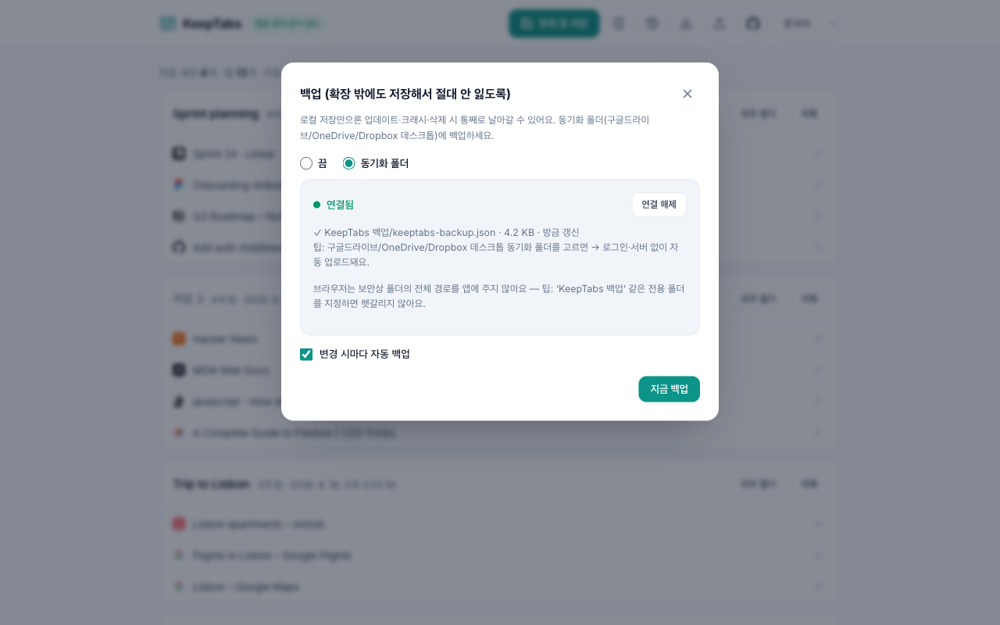

# KeepTabs 🔒

[English](README.md) | **한국어**

**탭을 절대 잃지 않는 Chrome 탭·세션 관리자입니다.**
창에 열린 탭을 한 번에 저장할 수 있습니다. KeepTabs는 **저장하거나 삭제할 때마다 버전을 자동으로 기록**하고, **열린 창도 주기적으로, 그리고 창을 닫을 때마다 자동으로 기록**합니다. 그래서 업데이트나 크래시가 발생하거나, 저장을 깜빡했거나, 실수로 삭제했더라도 언제든 이전 상태로 되돌릴 수 있습니다. 구독도 계정도 필요 없고, 데이터는 내 브라우저에만 저장됩니다(local-first).

### ▶︎ [Chrome에 추가하기 — 무료](https://chromewebstore.google.com/detail/obggnihijfooppjkddcpgpkmpcnamoap)

## 왜 만들었나 (포지셔닝)
대부분의 탭 저장 확장은 모든 데이터를 로컬 저장소 한 곳에만 보관합니다. 그래서 **업데이트, 크래시, 확장 삭제 한 번에 저장해 둔 탭이 통째로 사라질 수 있고**, 이는 오랫동안 반복된 문제입니다. 클라우드 기반 제품은 데이터를 안전하게 지켜 주지만, 그 대신 **월 구독료, 계정 종속, 데이터 신뢰 문제**가 따라옵니다.
KeepTabs는 이 빈틈을 채웁니다. **로컬 우선 + 자동 버전 백업 + 구독 없음 + 검증 가능(추적 없음)**을 동시에 제공합니다.

> "탭을 절대 잃지 않는 탭 관리자 — 로컬 우선, 자동 버전 백업, 원클릭 복원, 구독 없음, 계정 없음."

## 기능
- 툴바 아이콘을 누르면 **저장 팝업**에서 창의 탭을 미리 볼 수 있습니다. 저장할 탭을 고른 뒤 **저장하고 닫기**(클릭 한 번으로 정리), **저장만**, **닫기만** 중에서 선택합니다.
- 저장한 세션 목록에서 탭을 하나씩 또는 한꺼번에 열 수 있고, 세션이나 탭을 삭제할 수 있습니다.
- 세션 이름과 탭 제목, URL을 대상으로 **실시간 검색**을 할 수 있습니다.
- 세션 이름을 목록에서 바로 **변경**할 수 있습니다.
- **자동 버전 백업**: 모든 변경의 스냅샷을 최근 50개까지 보관합니다. "🕓 백업 기록"에서 이전 시점으로 되돌릴 수 있습니다.
- **열린 창 자동 스냅샷**: 5/15/30/60분마다(기본 15분), 그리고 창을 닫을 때마다 열린 창을 기록합니다. 최근 20개를 보관하고, 바뀐 것이 없으면 건너뛰며, 시크릿 창은 기록하지 않습니다. "🕓 백업 기록"에서 새 창으로 복원하거나 저장 목록에 추가할 수 있습니다.
- **내보내기와 가져오기**(JSON): 언제든 직접 백업할 수 있습니다.
- **동기화 폴더 백업**: Google Drive, OneDrive, Dropbox의 데스크톱 동기화 폴더를 지정하면 그 폴더에 `keeptabs-backup.json`을 자동으로 기록합니다. 로그인과 서버 없이 동작하고, 운영체제를 가리지 않습니다. 변경할 때마다 자동으로 백업하는 옵션도 있습니다.
- **영어와 한국어 UI**: 브라우저 언어를 자동으로 감지하고, 앱 안에서 바로 바꿀 수 있습니다.
- **앱 내 문의**: 💬 버튼으로 버그를 제보하거나 아이디어를 보내면 GitHub 이슈로 전달됩니다.

## 스크린샷

**저장한 세션 — 탭을 이름 붙인 세션으로 정리**

**버전 기록 — 원클릭 복원으로 모든 변경을 되돌리기**

**동기화 폴더 백업 — Google Drive / OneDrive / Dropbox, 계정·서버 없이**

## 절대 잃지 않는 설계
- `storage.js`의 `setState()`는 **데이터가 바뀔 때마다 전체 세션의 스냅샷을 기록에 추가합니다**(링 버퍼). 그래서 잘못된 덮어쓰기나 마이그레이션이 있어도 데이터가 조용히 사라지지 않습니다.
- `autosnap.js`는 `chrome.alarms` 타이머로 열린 창을 기록합니다. `wincache.js`는 창마다 마지막 탭 상태를 `chrome.storage.session`에 보관해서, 창이 닫힌 뒤에도 그 창을 기록할 수 있게 합니다. 이 스냅샷들은 별도의 저장 키를 쓰기 때문에, 자주 기록되더라도 50칸짜리 편집 기록을 밀어내지 않습니다.
- 데이터는 `chrome.storage.local`에 저장됩니다(로컬 우선). **탭 정보는 어떤 서버로도 전송되지 않으므로**, 개인정보 신뢰 문제가 처음부터 생기지 않고 서버 비용도 들지 않습니다. 선택 기능인 동기화 폴더 백업은 브라우저의 File System Access API를 사용하고, 사용자가 고른 폴더에만 파일을 씁니다. 유일한 네트워크 요청은 선택 기능인 문의 폼이며, 사용자가 입력한 텍스트만 중계 서버로 보내 공개 GitHub 이슈를 만듭니다. 자세한 내용은 [PRIVACY.md](PRIVACY.md)(영문)를 참고하세요.

## 설치
**Chrome 웹 스토어(권장):** **[Chrome에 추가하기](https://chromewebstore.google.com/detail/obggnihijfooppjkddcpgpkmpcnamoap)** — 클릭 한 번으로 설치되고 자동으로 업데이트됩니다.

소스를 직접 로드할 수도 있습니다(개발용).
1. `chrome://extensions`를 열고 오른쪽 위의 **개발자 모드**를 켭니다.
2. **압축해제된 확장 프로그램을 로드합니다**를 누르고 이 폴더를 선택합니다.
3. 툴바의 KeepTabs 아이콘을 누르고, 팝업에서 탭을 골라 저장합니다.

## 개발
- 빌드 단계가 없습니다. 확장이 일반 ES 모듈을 그대로 불러옵니다.
- 다국어: manifest의 이름, 설명, 제목은 `_locales/`(`default_locale: en`, `ko` 추가)로 처리합니다. 앱 UI는 작은 런타임 i18n(`i18n.js`)과 언어 전환 메뉴를 사용합니다.
- 단위 테스트(Node 내장 테스트 러너, CI와 같은 명령): `node --test tests/*.test.mjs`. storage, 백업 설정, i18n, 검색, 자동 스냅샷, 창 캐시, 문의 중계 서버를 다룹니다.
- `worker/`는 문의 폼을 처리하는 Cloudflare Worker입니다. 확장과 따로 배포하며, 스토어 패키지에는 포함되지 않습니다.
- `harness.html`은 git에서 제외된 로컬 페이지로, `chrome` API를 목(mock)으로 바꿔 UI(`list.js`, `list.css`)를 빠르게 확인하는 용도입니다.
- Chrome 웹 스토어 릴리스(권한을 추가하는 릴리스 포함)와 문의 중계 서버 배포는 [RELEASE.md](RELEASE.md)(영문)를 참고하세요.

## 로드맵
- [ ] 기기 간 동기화 개선과 유료 요금제 (여전히 사용자가 소유한 저장소, 서버 없음)
- [ ] 세션 태그
- [ ] 탭 그룹 저장과 복원 (이름, 색, 접힘 상태)
- [ ] 백업 파일 예약·주기 다운로드
- [ ] 프리미엄: 기본 기능 무료 + 일회성/평생 $15–25 (동기화와 고급 복구 기능 잠금 해제)

## 문의
버그를 발견했거나 아이디어가 있다면 KeepTabs의 💬 버튼을 누르거나 [GitHub 이슈](https://github.com/thomas783/keeptabs/issues)를 남겨 주세요. 이슈는 공개되므로 개인정보는 적지 말아 주세요.

## 현황
🎉 **Chrome 웹 스토어에 게시되었습니다** — [여기에서 설치하세요](https://chromewebstore.google.com/detail/obggnihijfooppjkddcpgpkmpcnamoap). 로컬 우선, 계정 없음, 추적 없음.
