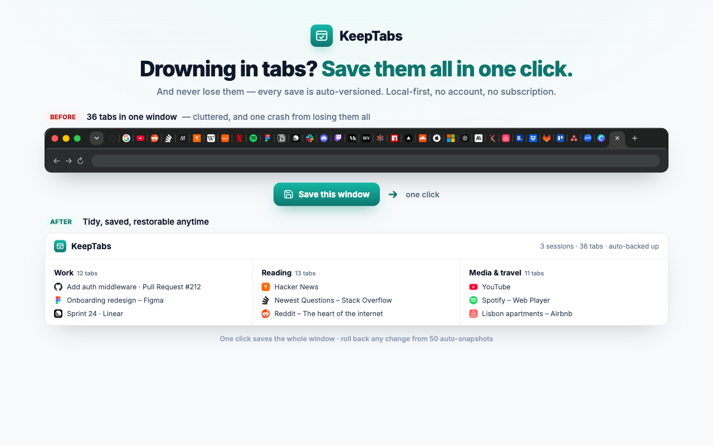
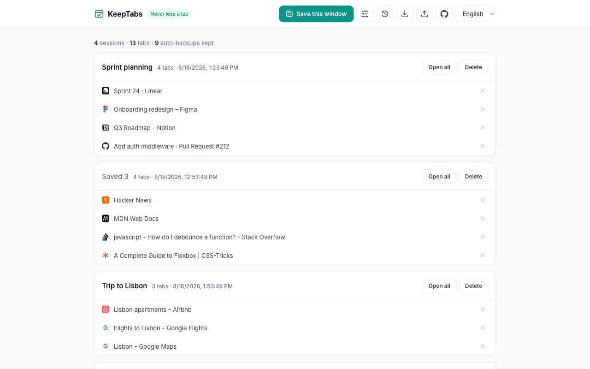
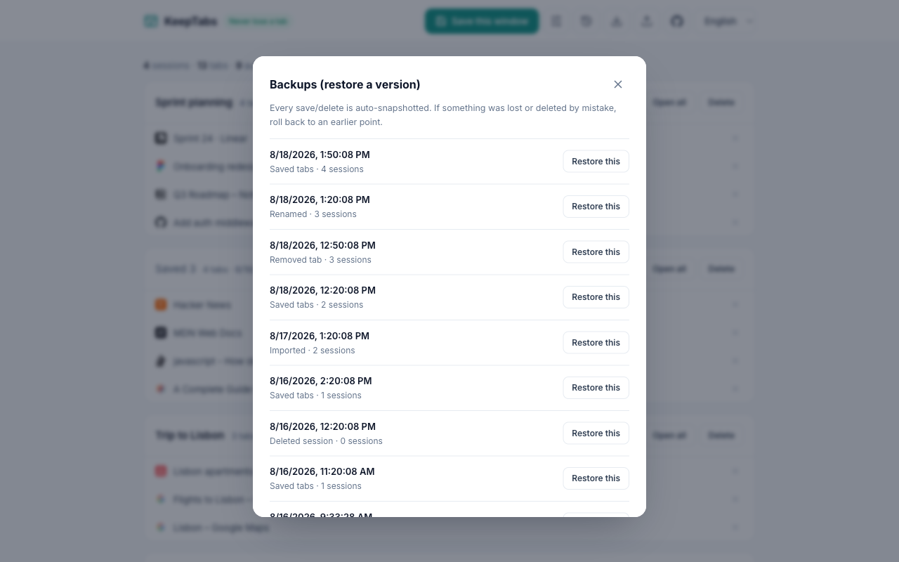
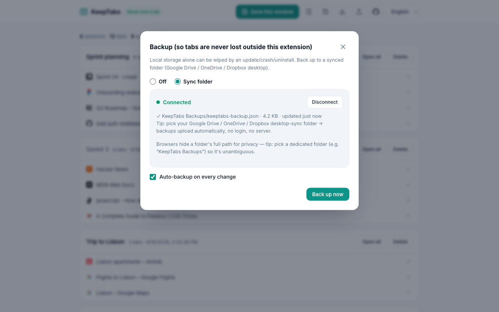

# KeepTabs 🔒

**A Chrome tab/session manager that never loses your tabs.**
Save all your open tabs at once like OneTab or Session Buddy — but KeepTabs **auto-snapshots a version on every save and delete**, so an update, crash, or accidental deletion can always be rolled back. No subscription, no account, local-first.

### ▶︎ [Add to Chrome — it's free](https://chromewebstore.google.com/detail/obggnihijfooppjkddcpgpkmpcnamoap)

## Why it exists (positioning)
OneTab (~2M users) and Session Buddy (~1M) store everything locally, so **an update / crash / uninstall can wipe your saved tabs entirely** — a top complaint left unfixed for years. Cloud alternatives (Toby, Workona) solve durability but are disliked for **monthly subscriptions, account lock-in, and data-trust concerns**.
The gap = **local-first + automatic version backups + no subscription + auditable (no telemetry)**.

> "A tab manager that never loses your tabs — local-first, automatic version backups, one-click restore, no subscription, no account."

## Features
- Click the toolbar icon → **save every tab in the current window and close the originals** (OneTab-style)
- Saved-session list · open individually or all at once · delete sessions/tabs · remove single tabs
- **Rename sessions** inline
- **Automatic version backups**: a snapshot of every change is kept (last 50) → restore an earlier point from "🕓 Backups"
- **Export / Import** (JSON) — back up by hand anytime
- **Sync-folder backup**: point KeepTabs at a Google Drive / OneDrive / Dropbox desktop-sync folder and it writes `keeptabs-backup.json` there automatically — no login, no server, cross-platform. Optional auto-backup on every change.
- **Bilingual UI** (English / Korean), auto-detected from your browser and switchable at runtime

## Screenshots
| Saved sessions | Version history (one-click restore) | Sync-folder backup |
|:---:|:---:|:---:|
|  |  |  |

## Never-lose design
- `setState()` in `storage.js` **appends a full snapshot of all sessions to history on every mutation** (ring buffer). No destructive overwrite or migration can silently lose data.
- Data lives in `chrome.storage.local` (local-first). **Nothing is sent to any server** → removes the privacy-trust problem at the source, and server cost is zero. The optional sync-folder backup uses the browser's File System Access API and writes only to a folder you pick. See [PRIVACY.md](PRIVACY.md).

## Install
**From the Chrome Web Store (recommended):** **[Add to Chrome](https://chromewebstore.google.com/detail/obggnihijfooppjkddcpgpkmpcnamoap)** — one click, auto-updates.

Or load the source unpacked (for development):
1. Open `chrome://extensions` → turn on **Developer mode** (top right)
2. **Load unpacked** → select this folder
3. Click the KeepTabs icon in the toolbar → the current window's tabs are saved

## Development
- No build step — plain ES modules loaded by the extension.
- Localization: manifest name/description/title via `_locales/` (`default_locale: en`, plus `ko`); the in-app UI uses a small runtime i18n (`i18n.js`) with a language toggle.
- Unit tests (Node's built-in test runner): `node --test tests/*.mjs` — covers storage, backup settings, and i18n.
- `harness.html` is a git-ignored local page that runs the UI (`list.js`/`list.css`) against a mocked `chrome` API for quick visual testing.

## Roadmap
- [ ] Cross-device sync polish and paid tier (still user-owned storage, no server)
- [ ] Search and tags for sessions
- [ ] Scheduled/periodic backup-file downloads
- [ ] Freemium: free core + one-time / lifetime $15–25 (unlock sync & advanced recovery)

## Status
🎉 **Published on the Chrome Web Store** — [install it here](https://chromewebstore.google.com/detail/obggnihijfooppjkddcpgpkmpcnamoap). Local-first, no account, no telemetry.
