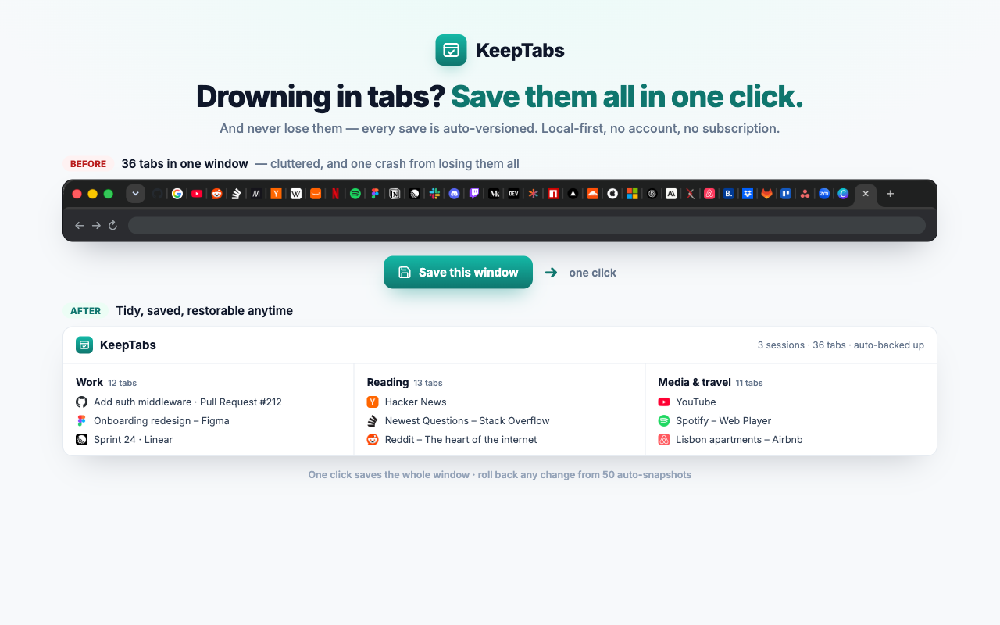
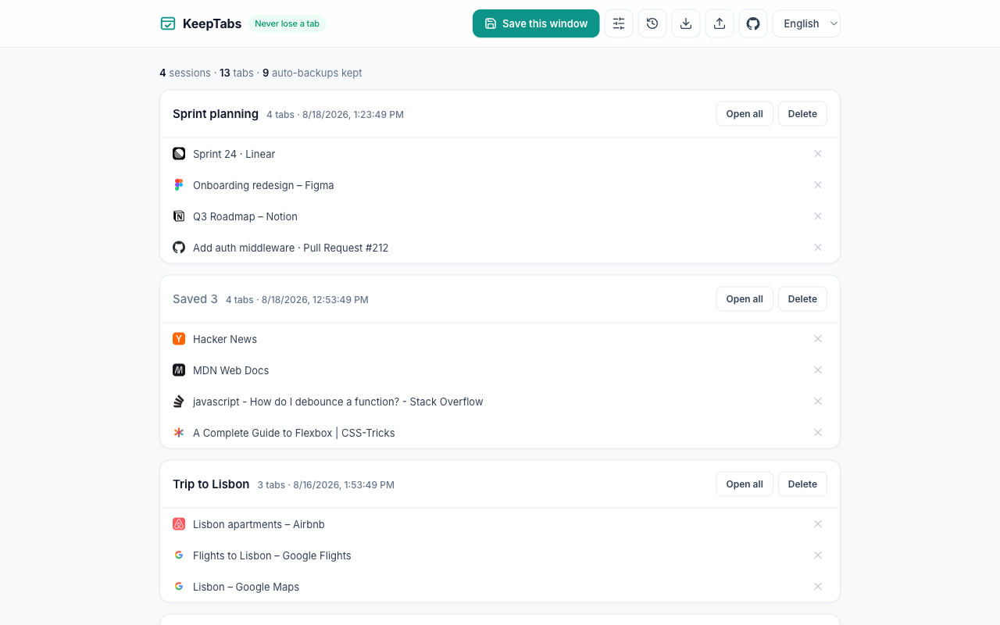
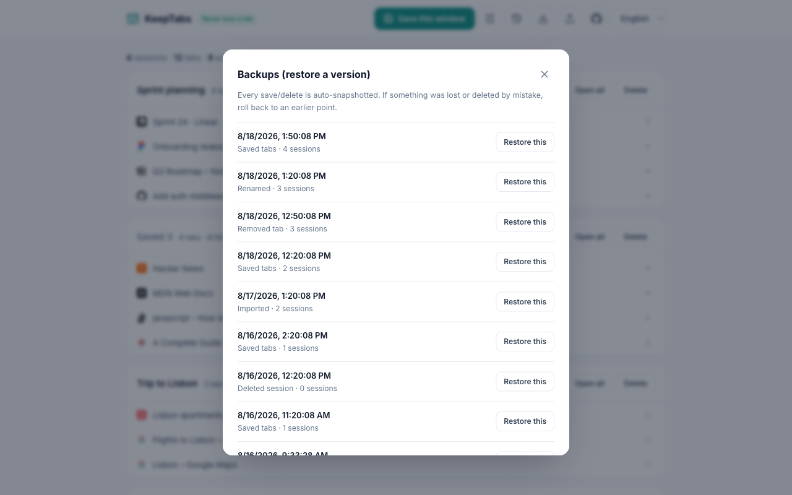
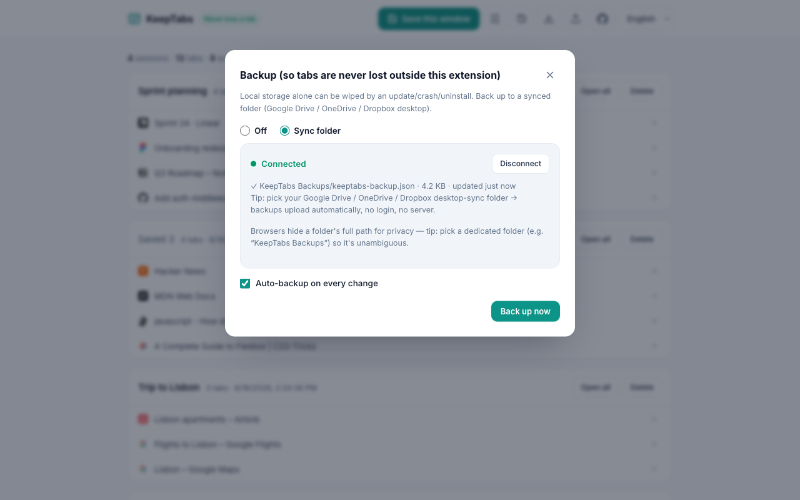

# KeepTabs 🔒

**English** | [한국어](README.ko.md)

**A Chrome tab/session manager that never loses your tabs.**
Save your whole window of tabs at once, and KeepTabs **auto-snapshots a version on every save and delete** — and **auto-captures your open windows** on a timer and whenever a window closes — so an update, crash, forgotten save, or accidental deletion can always be rolled back. No subscription, no account, local-first.

### ▶︎ [Add to Chrome — it's free](https://chromewebstore.google.com/detail/obggnihijfooppjkddcpgpkmpcnamoap)

## Why it exists (positioning)
Most tab savers keep everything in local storage, so **an update / crash / uninstall can wipe your saved tabs entirely** — a long-standing pain point. Cloud-based options solve durability but bring **monthly subscriptions, account lock-in, and data-trust concerns**.
The gap KeepTabs fills = **local-first + automatic version backups + no subscription + auditable (no telemetry)**.

> "A tab manager that never loses your tabs — local-first, automatic version backups, one-click restore, no subscription, no account."

## Features
- Click the toolbar icon → a **save popup** previews the window's tabs; pick which to keep, then **Save & close** (clear the clutter in one click), **Save only**, or **Close only**
- Saved-session list · open individually or all at once · delete sessions/tabs · remove single tabs
- **Live search** across session names and tab titles/URLs
- **Rename sessions** inline
- **Automatic version backups**: a snapshot of every change is kept (last 50) → restore an earlier point from "🕓 Backups"
- **Auto-snapshots of open windows**: every 5/15/30/60 min (default 15) and whenever a window closes, KeepTabs records your open windows (last 20, unchanged captures skipped, incognito never recorded) → reopen them or save them to your list from "🕓 Backups"
- **Export / Import** (JSON) — back up by hand anytime
- **Sync-folder backup**: point KeepTabs at a Google Drive / OneDrive / Dropbox desktop-sync folder and it writes `keeptabs-backup.json` there automatically — no login, no server, cross-platform. Optional auto-backup on every change.
- **Bilingual UI** (English / Korean), auto-detected from your browser and switchable at runtime
- **In-app feedback**: report a bug or suggest an idea from the 💬 button — it arrives as a GitHub issue

## Screenshots

**Saved sessions — your tabs, tidied into named sessions**

**Version history — roll back any change with one-click restore**

**Sync-folder backup — Google Drive / OneDrive / Dropbox, no account, no server**

## Never-lose design
- `setState()` in `storage.js` **appends a full snapshot of all sessions to history on every mutation** (ring buffer). No destructive overwrite or migration can silently lose data.
- `autosnap.js` captures open windows on a `chrome.alarms` timer, and `wincache.js` keeps each window's last-known tabs in `chrome.storage.session` so a window can still be snapshotted after it closes. These snapshots use their own storage key, so frequent captures never push your edit history out of its 50 slots.
- Data lives in `chrome.storage.local` (local-first). **Your tabs are never sent to any server** → removes the privacy-trust problem at the source, and server cost is zero. The optional sync-folder backup uses the browser's File System Access API and writes only to a folder you pick. The only network request is the optional feedback form, which sends just the text you type to a relay that opens a public GitHub issue. See [PRIVACY.md](PRIVACY.md).

## Install
**From the Chrome Web Store (recommended):** **[Add to Chrome](https://chromewebstore.google.com/detail/obggnihijfooppjkddcpgpkmpcnamoap)** — one click, auto-updates.

Or load the source unpacked (for development):
1. Open `chrome://extensions` → turn on **Developer mode** (top right)
2. **Load unpacked** → select this folder
3. Click the KeepTabs icon in the toolbar → pick tabs in the popup and save them

## Development
- No build step — plain ES modules loaded by the extension.
- Localization: manifest name/description/title via `_locales/` (`default_locale: en`, plus `ko`); the in-app UI uses a small runtime i18n (`i18n.js`) with a language toggle.
- Unit tests (Node's built-in test runner, same command as CI): `node --test tests/*.test.mjs` — covers storage, backup settings, i18n, search, auto-snapshots, the window cache, and the feedback relay.
- `worker/` is the Cloudflare Worker behind the feedback form (deployed separately, not part of the store package).
- `harness.html` is a git-ignored local page that runs the UI (`list.js`/`list.css`) against a mocked `chrome` API for quick visual testing.
- Releasing to the Chrome Web Store (including releases that add a permission) and deploying the feedback relay: see [RELEASE.md](RELEASE.md).

## Roadmap
- [ ] Cross-device sync polish and paid tier (still user-owned storage, no server)
- [ ] Tags for sessions
- [ ] Save and restore tab groups (name, color, collapsed state)
- [ ] Scheduled/periodic backup-file downloads
- [ ] Freemium: free core + one-time / lifetime $15–25 (unlock sync & advanced recovery)

## Feedback
Found a bug or have an idea? Use the 💬 button in KeepTabs, or [open an issue](https://github.com/thomas783/keeptabs/issues). Issues are public, so please leave out personal info.

## Status
🎉 **Published on the Chrome Web Store** — [install it here](https://chromewebstore.google.com/detail/obggnihijfooppjkddcpgpkmpcnamoap). Local-first, no account, no telemetry.
